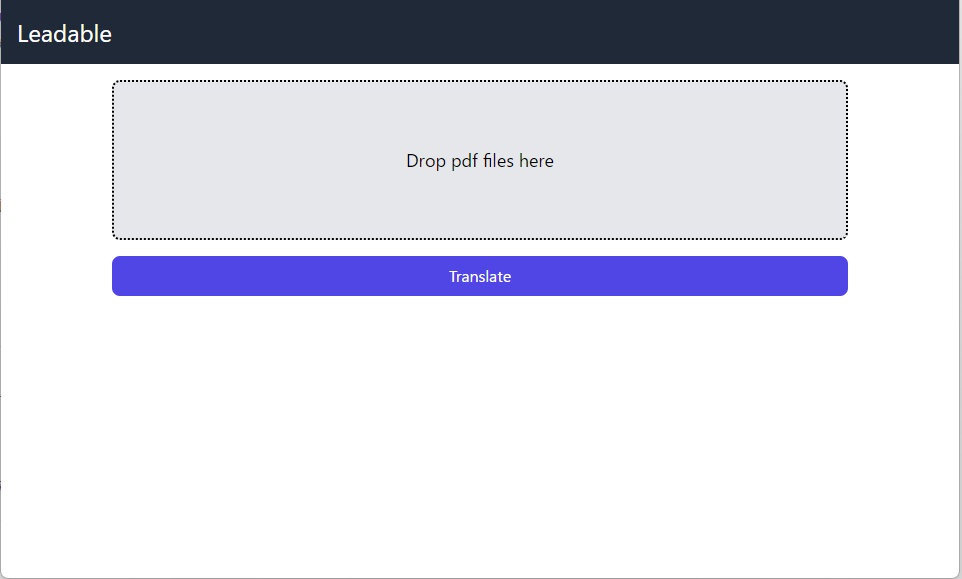
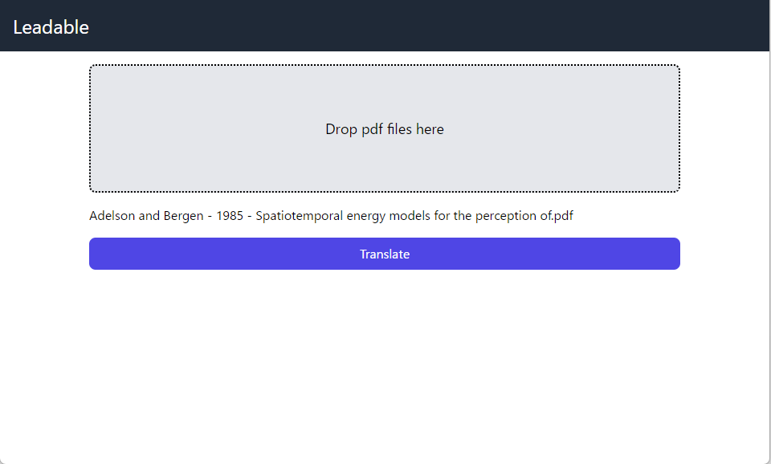
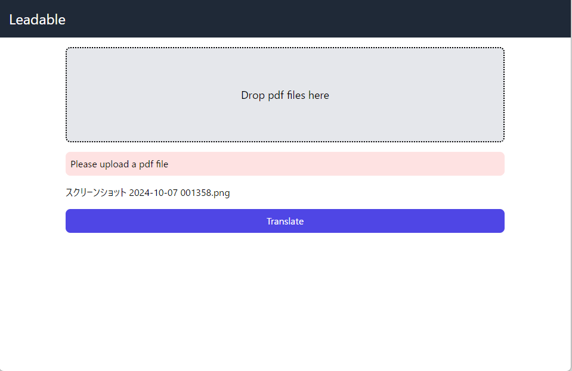
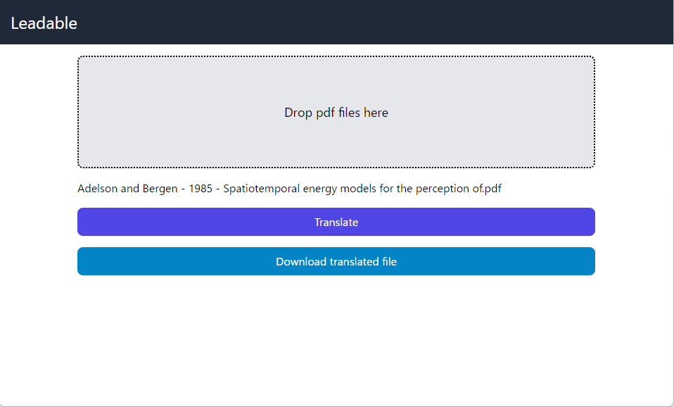

# アプリ概要

翻訳したいPDFをエリアにドロップ

正しくPDFファイルが読み込まれた場合

PDFファイル以外をドロップした場合

「Translate」を押して翻訳をし，翻訳が完了したら「Download translated file」のボタンが現れる．

# ファイル構造
* `/api` ダミーのバックエンドAPI(FastAPI) 
* `/frontend` Vue.jsプロジェクト
* `/docs` README.md用の画像
* `.env.sample` .envのサンプル（実行時はこのファイルに従って，必ず`.env`を配置すること）
* `docker-compose.yml` Vue.jsとダミーのバックエンドAPI立ち上げ用

# 実行コマンド

`docker compose up --build`

# 使用ライブラリ
### バックエンドAPI(Python)
* FastAPI
* uvicorn

### フロントエンド(Vue.js)
* axios
* tailwindcss
* postcss
* autoprefixer
